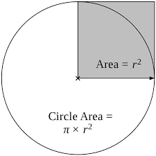
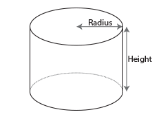

# CSCI 1103 Computer Science I Honors

## Fall 2019

Boston College

---

## Lecture Notes
## Week 1

**This Week:**

1. What CSCI 1103 is About
2. Course Administration & Logistics
3. Coding Logistics
4. OCaml: basic types; literals & expressions; simplification & work; values
5. Libraries

---

## 1. What CSCI 1103 is About

**Three interwoven themes**

1. Learning about *computation* and *information* as subjects of study;
2. Learning how to express your ideas in code;
3. An introduction and gateway to computer science as a field of inquiry and/or as a major.

---

**Learning how to code**

+ Application of logic in problem solving (*math-ish*)
+ Clear, concise expression of ideas/algorithms (*english/poetry-ish*)
+ Learn by doing!
+ Empowering in almost any field — Have an idea? You can build it!
+ Interesting, fun & rewarding

---

**Take-aways — by the end of the semester**

+ You’ll have a reasonably robust understanding of computation;
+ You’ll be skilled — able to think “computationally” able to code!
+ You’ll have a better understanding of computer science as a field of study;
+ You’ll be a competent beginning programmer and will be able to pick up other programming languages such as Python or Java easily;

- You’ll be especially well-prepared for the follow-on course CSCI 1102 Computer Science 2.

---

## Computation and Calculation

**Four Aspects of Computation**

1. **Simplification** & the **Work** it requires
2. **Abstraction** and **Composition**

#### 1. Expression Simplification & the Work it requires

For most of us, the first real algorithms we learned were the intricate steps required to carry out addition, subtraction, multiplication and division of numbers. We learned these basic algorithms as children at the age of 6 or 7 or so. Then we were on to *arithmetic* where the basic arithmetic operations are combined in larger expressions and we learn the precedence and associativity rules that allow us to reduce the expressions step-by-step to a number.

```
2 + 3 * 4 = 2 + 12 = 14
```

The direction of the computation — the ancient idea that computation goes from something more complicated to something simpler — can be made explicit by replacing the equal sign with an arrow `->`.

```
2 + 3 * 4 ->
  2 + 12 ->
  14
```

Speaking computationally, we can see that the symbol manipulation process of going from `2 + 3 * 4` to its *value* `14` takes 2 computation steps. Of course this sets aside the work required to carry out the `+` and `*` operations, this can be ignored for now.

Later in *algebra*, we studied symbolic algebraic expressions like the quadratic $ax^2 + bx + c$, where $a$, $b$ and $c$ are *symbolic constants* and $x$ is a *variable*. In algebra, we learned how to reason abstractly about such expressions, how to factor them, how to solve for their roots, how to reason about the curves they define on the $xy$-plane, etc. 

> **History** Algebra has a long and interesting history with ideas flowing east and west over South Asian trade routes for many centuries. Many of the key ideas underpinning modern algebra were developed by Hindu scholars in present-day Pakistan and India and were conveyed to the west through the writings of the 9th century Persian mathematician, [Al-Khwarizmi]() in his text *Al-jabr wa'l muqabalah* (*The Compendious Book on Calculation by Completion and Balancing*). [The Arabic prefix "al", roughly speaking, means "the" and "Khwarizmi" means "person from Khorasan" — a country that no longer exists but is part of current day Uzbekistan. al-Khwarizmi was said to be from Khiva, one of the main trading sites on the Silk Road. As an adult he relocated west to the famous [House of Wisdom](https://en.wikipedia.org/wiki/House_of_Wisdom) in Baghdad.] The word "algebra" is derived from the first word of that title and the word "algorithm" is an anglicized version of "*Algoritmi*", the Latin form of his name. Al-Khwarizmi's ideas weren't conveyed to the west for another 400 years when the by [Leonardo Bonacci](**Leonardo Bonacci**) when, in 1202, he published [Liber Abaci](https://en.wikipedia.org/wiki/Liber_Abaci) (*The Book of Calculation*).
>
> Modern symbolic algebra was introduced by the French mathematician and cryptographer [Francois Viete]() at the end of the 16th century. His notation was refined by [Descartes](https://en.wikipedia.org/wiki/Ren%C3%A9_Descartes) and later by [Leibniz](https://en.wikipedia.org/wiki/Gottfried_Wilhelm_Leibniz) and [Euler]() among others. It was Descartes who adopted the use of letters near the front of the alphabet for constants and letters near the back for variables. Descartes also invented the superscript $x^2$ to denote exponentiation. Leibniz later coined the terms *constant*, *variable* and *function*. It was Euler who invented function application notation $f(x)$.

Plugging in constants, say 3, 2 and 1 in for the symbols $a$, $b$ and $c$ in the expression above leaves us with $3x^2 + 2x + 1$, an algebraic expression of one variable $x$. We know a lot about this expression, e.g., since 3 is positive, the defined parabola curves upward. But we can't compute the expression's value on any point of the curve until we've plugged a number in for the variable $x$. Plugging in, say 5, we can then simplify as before.

```
3 * 5^2 + 2 * 5 + 1 ->
  3 * 25 + 2 * 5 + 1 ->
  75 + 2 * 5 + 1 ->
  75 + 10 + 1 ->
  85 + 1 ->
  86
```

In a process requiring 5 simplification steps, we've arrived at our answer, the value 86. In this case, we could have simplified several sub-expressions at once:

```
3 * 5^2 + 2 * 5 + 1 -->
  3 * 25 + 10 + 1 -->
  75 + 11 -->
  86
```

Five units of work in 3 parallel steps.

This course introduces coding in a style following the ancient tradition of viewing computation as a process of simplification. A major theme is consideration of the amount of work required in the process of carrying out the computation. In this course, we'll usually measure work by the number of steps (i.e., arrows) required in the process of simplifying an expression to its value.

---

#### 2. Abstraction & Composition

Algebraic expressions are often packaged up as *functions*. For example, in mathematics it's common to  associate the name $f$ with algebraic expressions like the one above. (This convention was introduced by [Leonhard Euler](https://en.wikipedia.org/wiki/Leonhard_Euler) in 1734.) The symbol $x$'s role as a variable can be specified explicitly by writing it in parentheses adjacent to the function name on the left of an equal sign:

$f(x) = 3x^2 + 2x + 1$

We can take this equation as a *definition* of function $f$ as a computation rule, the chosen name $f$ is an abstraction of its definition. Of course $f$ is the first letter of "function", and it's easy to write with a quill, but otherwise it's a pretty uninformative name.

**Function Definitions and Uses**

>  **History** The concept of a function has ancient roots, the basic properties were known to the Bablyonians and to the Greeks. The modern understanding of function developed in part as a consequence of Viete's work on symbolic algebra and the work done by Descartes, Leibniz and Newton, the Bernoullis and Euler. In the 18th century  
>
>  Euler' in 1734, who says, "Si $f(\frac{x}{a} + c)$ denotet functionem quamcunque ipsius $\frac{x}{a} + c$"

​			
​	

> *When I consider what people generally want in calculating, I found that it always is a number.*
>
> — al Khwarizmi

Euler’s notation for *uses*, *calls* or *applications* of function f:  

```
f(x) = 3 * x^2 + 2 * x + 1          function definition

f(5) or f(2 + 2)                    function calls, applications or uses
```

**Simplification of function calls — replacement**

1. Simplify the argument to its value $v$,
2. plug the value $v$ in for $x$, i.e., *replace* $x$ with $v$,
3. simplify the result.

```
f (2 + 2) ->
  f 4 ->
  3 * 4^2 + 2 * 4 + 1 ->             (* The variable x has been replaced by 4. *)
  3 * 16 + 2 * 4 + 1 ->
  48 + 2 * 4 + 1 ->
  48 + 8 + 1 ->
  56 + 1 ->
  57
```

**Functions and Code**

- Roughly speaking, a software application — an app — is a collection of functions;
- In HS algebra our functions usually worked with real numbers; in programming, there are many, many interesting types of inputs for our functions.

---

**Example in OCaml: Area of a Circle**



```ocaml
(* area : float -> float
*)
let area radius = 3.14 *. radius ** 2.0
```

**Simplifying**

```ocaml
area (1.0 +. 1.0) ->
  area 2.0 ->
  3.14 *. 2.0 ** 2.0 ->
  3.14 *. 4.0 ->
  12.56          (* a value -- an expression that can't be further simplified; 4 units of work *)
```

**Example in OCaml: Volume of a Cylinder**



```ocaml
(* volume : float -> float -> float
*)
let volume radius height =
  let circleArea = area radius          (* NB: making use of area function from above. *)
  in
  circleArea *. height
```

The definition of the `volume` function uses the `area` function defined above. The value returned by the `area` function is captured by the `let-in` form in a local variable `circleArea`. The `circleArea`  variable is local in the sense that it can only be used in the single expression following the `in` keyword.

**Simplifying**

```ocaml
volume (1.0 +. 1.0) 3.0 ->
  volume 2.0 3.0 ->
  let circleArea = area 2.0 in circleArea *. 3.0 -> 
  let circleArea = 3.14 *. 2.0 ** 2.0 in circleArea *. 3.0 ->
  let circleArea = 3.14 *. 4.0 in circleArea *. 3.0 ->
  let circleArea = 12.56 in circleArea *. 3.0 ->
  12.56 *. 3.0 ->
  37.68                                  (* value obtained with 7 units of work *)
```

---

## 2. Course Administration & Logistics

**Required Background**

- No programming experience required;
- Middle school algebra;
- Familiarity with basic trigonometry and geometry also helpful;
- A taste for building things also helpful.

------

**Required Work**

- One hundred and fifty minute lectures each week, strongly advised to attend — **open laptops prohibited!**
- One 50-minute lab each week, strongly advised to attend — **laptops required!**
- Ten coding projects, some solo, some team; time required varies from week to week but expect ~8-10 hours of work each week,
- Three exams.

---

**Course Outline — Month to Month**

1. Learn to code
2. Learn about digital computers
3. Learn about applications

**Course Outline — Week to Week**

1. Getting started: course admin & logistics; basic types, literals & expressions; simplification & work; values; libraries
2. Names: `let` and `let-in`; function definitions and calls; types: explicit & implicit; the graphics library
3. Tuples & pattern matching; record & sum types; branching; lists & recursive list processing
4. Working with lists; computational shapes; working with numbers, primality; working with repetitive images
5. **First exam**; functions are values: the map, filter & fold idioms; animation — the model-view-update idiom
6. Putting things in order: insertion sort, quicksort & merge-sort; average and worst-case assessments of work
7. Dictionaries: key-value association lists; binary search trees; working with the Map module
8. Digital representations, numeral systems, binary & hex, converting between bases; a ripple-carry adder
9. Digital computers & storage architecture; SVM: a Simple Virtual Machine; storage diagrams
10. **Second exam**; Imperative coding in OCaml: sequencing, mutable references, arrays, for-loops & while-loops
11. More on imperative coding; search problems
12. Applications of arrays: digital audio & digital images
13. Working with strings and text files; applications in bioinformatics
14. Type abstraction (abstract data types) in OCaml and Java; review and wrap-up

---

**Lab Schedule**

1. Getting Started: System setup
2. Working with the Unix command shell
3. Working with git, GitHub & markdown
4. Working with lists
5. Working with the graphics library
6. Functions are values
7. Working with dictionaries
8. Numeral systems
9. SVM
10. Imperative coding: for-loops & arrays
11. Working with strings & and text files
12. Making new types

---

**Resources**

- Most of our material is covered in lecture, background reading in [OCaml from the Very Beginning](http://ocaml-book.com/);
- Lecture notes posted to the course homepage;
- Notes from Cornell's [CS3110;](https://www.cs.cornell.edu/courses/cs3110/2019fa/)
- Office hours, Piazza, your colleagues, the internet.

------

**Teaching Assistant Staff**

- Jacob Bennett, Head Teaching Assistant — Section 01: Higgins 280; Mondays 4PM
- Gavin Bloom — Section 02: Higgins 280; Mondays 5PM
- Darius Russell Kish — Section 03: Higgins 275; Tuesdays 5PM
- Matthew Spana — Section 04: Higgins 280; Tuesdays 6PM

---

**Grading**

Grades are calculated on a 200 point scale.

- 90 points for 10 problem sets, plenty of opportunity for extra credit
- 80 points for 3 exams (20, 20, 40)
- 30 points for consistent course participation in Lab, lecture & the Piazza forum

NB: The instructor reserves the right to adjust these percentages based on discrepancies between submitted problem sets and exams.

------

**Rules of the Road**

- Late homework penalty 25% each day, penalty excused only for documented medical problems or family emergencies only;
- University policy on academic integrity strictly enforced.

---

### How to Succeed in CSCI 1103

+ Show up consistently, participate in class, ask & answer questions;
+ Start problem sets right away;
+ Pay careful attention to detail;
+ Seek help when you need it;
+ This class is definitely a team sport:


------

**Why OCaml?**

- Computation can be approached from either a mathematical or a mechanical perspective. From the mathematical point of view, coding is just a natural extension of algebra. In OCaml
  - variables correspond to mathematical variables;
  - functions correspond to mathematical functions;
  - repetition is naturally expressed via recursion — a close cousin of [mathematical induction](https://en.wikipedia.org/wiki/Mathematical_induction), a powerful mathematical reasoning principal.


- Ocaml emphasizes the most important ideas:

  - primacy of functions : abstraction & composition; parametric polymorphism; type inference;
  - computation as simplification
- Static types:

  - detect many errors as the code is written, i.e., before the code is executed in the field;
  - help guide
    - individual coders in decomposing problems into manageable parts;
    - development teams in scaling-up large software systems;
  - allow the coder to make impossible code states unrepresentable;
  - lead to safer, faster code
- Being introduced to coding in OCaml will make it easy to learn other programming languages and help you write better code in any language
- A number of popular programming languages now embody some of the main ideas from OCaml:

  - Modern JavaScript
  - Swift (Apple)
  - Scala
  - Reason (Facebook)
  - TypeScript, F# (Microsoft)
  - Rust (Mozilla)
- Other PLs now borrow heavily: Java, C#, R, Go
- OCaml does not have the problematic [null](https://www.infoq.com/presentations/Null-References-The-Billion-Dollar-Mistake-Tony-Hoare) that plagues languages like Java and C

---

### 3. Coding Logistics

In this course we'll be using the Unix operating system and the Unix command shell to develop, manage and execute OCaml code. We'll provide you with a virtual machine (VM) running Unix on your computer. The details are spelled out in problem set 1. We'll be using git and GitHub to manage the distribution and submission of problem sets and related materials. We'll be using the Uehara/Asai [Universe Library](http://pllab.is.ocha.ac.jp/~asai/Universe/) for graphics & animation in OCaml.

A *program* is a specially structured piece of text that expresses a computational process to be carried out by a computer. The particulars of the structure of the text depend on the programming language. Programs are usually written with a text editor. In this course, we'll be using the [Atom](https://atom.io/) text editor to write programs in the OCaml dialect of the ML programming language. Atom is available for free, complements of GitHub.

Once a program is written, it can be executed by the computer either through a process of *translation* of the program to another language or by direct *interpretation*. The translation process is called *compilation* and the program that performs the translation is called a *compiler*.

#### Compilation

```
+---------+       +---------------+      +----------+
| source  +------>|   compiler    +----->|  object  |  
| program |       |  /translator  |      |   code   |
+---------+       +---------------+      +----+-----+
                          ^                   |
                          |                   v
+---------+               |              +----------+      +--------------+
| library +---------------+------------->|  linker  +----->|  executable  |
|  code   |                              +----------+      +--------------+
+---------+
```

The diagram shows that programs invariably depend on existing libraries of code that provide additional functionality. The *object code* and the *executable* can be expressed in:

1. the language of the underlying host computer, so-called *native code*;
2. a language of *byte-codes* suitable for execution by another program called a *byte-code interpreter* (a *virtual machine* or VM);
3. some other high-level language, e.g., JavaScript.

#### Interpretation

An *interpreter* is a program that reads an expression in some programming language and evaluates it directly without translating it. 

```
                                          +------------------+
          +----------------+              |                  |
          | source program +------------> |    interpreter   |
          +----------------+              |                  |
                                          +------------------+                  REPL
          +----------------+                       ^
          |  library code  +-----------------------+
          +----------------+
```

Interpreters typically follow a four-step cycle called a read-eval-print loop (REPL):

    1. **Read**: prompt the user for and read the text of an expression;
    
    2. **Evaluate**: *simplify* the expression to find its *value* if it has one;
    
    3. **Print**: print the value to the evaluation shell;
    
    4. **Loop**: back to step 1.

Since OCaml is a typed programming language, step 3 of its REPL also prints the type of the value.  For example, an interaction with OCaml's REPL might look like:

```
# 2 + 3 * 4;;
- : int = 14
```

The hash symbol `#` is OCaml's prompt and the trailing pair of semicolons `;;` is the user's signal to OCaml that the text of the expression is complete and ready for evaluation.

**Using the OCaml Compiler**

In this course, we'll use both the OCaml compiler, **ocamlc** and the REPL **ocaml**. Both can be invoked directly from the Unix command line. To compile an ocaml source file *myfile.ml*, one could type:

```bash
> ocamlc -o go myfile.ml
```

Then the program can be executed in a separate step with something like

```bash
> ./go
```

Since we'll often be using custom libraries, the compilation process will usually be configured by a **Makefile** and the Unix *make* command:

```bash
> make
> ./go
```

**Using the OCaml REPL**

The REPL can be invoked directly from the Unix command line as in:

```
> ocaml
```

But we'll usually running the REPL from within the Atom editor by typing

```
ctrl-y ctrl-o
```

---

### 4. Basic Types; Literals & Expressions, Simplification & work; Values

In this section we'll introduce OCaml expressions. We'll often refer to and annotate the process of simplification with arrows:

```ocaml
2 + 3 * 4 ->
  2 + 12 ->
  14
```

The literal `14` is a *value*. As noted above, a value is an expression that can't be further simplified.

##### Comments

```ocaml
# (* Everything between open paren, star and star, close paren is a comment -- ignored by OCaml *)
# 
```

In computing, *types* can be understood as sets of "things" that are the subject of the computation. All programming languages provide a number of basic types such as `int` and `float` that are built-in to the language. Most programming languages provide the programmer with ways to define new types. We'll get to that subject later.

Virtually all programming languages have basic types `int` and `float` together with built-in operators (e.g., `+`, `-`, `*`, `/`, `mod`, etc) that work on values of that type.

##### The **int** Type

```ocaml
# 343;;
- : int = 343             (* 343 is a literal or constant expression of type int *)
                        
# max_int;;
- : int = 4611686018427387903

# min_int;;
- : int = -4611686018427387904
                        
# 5 * 2;;
- : int = 10            (* 10 is the value of the expression 5 * 2.*)
```

>  **CONVENTION**: Operators should have spaces on either side. So `5 / 2` is good, `5/2` is less good, and the asymmetrical spaces in both `5 /2` and `5/ 2` are bad. Some coders prefer a style in which operators of lower precedence are surrounded by spaces while operators of higher precedence are not.  For example, instead of
>
>  ```
>  a * x + b * x + c
>  ```
>
>  one might write:
>
>  ```
>  a*x + b*x + c
>  ```
>
>  But this can be a little clumsy so in the code developed in this course we'll require spaces around all operators.

##### Integer division

```ocaml
# 11 / 4;;
- : int = 2

# 1 / 2;;
- : int = 0

# 11 mod 4;;
- : int = 3

# 1 / 0;;
Exception: Division_by_zero.
```

Division by 0 gives rise to an error condition called an *exception*. This is an error that can be detected during program execution.

##### The float Type

```ocaml
# 3.14;;
- : float = 3.14

# 314e-2;;                (* exponential notation, standard for all PLs *)
- : float = 3.14

# 2.0 *. 3.14;;
- : float = 6.28

# 5.0 /. 2.0;;
- : float = 2.5

# 2.0 ** 3.0;;            (* 2.0^3.0 *)
- : float = 8.

# infinity;;
- : float = infinity

# 1.0 /. 0.0;;
- : float = infinity
```

##### Operators as Functions — prefix notation

An *operator* is a function which, for purely historical reasons, is placed *between* it's operands rather than to the left. OCaml has the usual complement of operators as shown above though OCaml is a little unusual in that it has different operators, e.g., `+` and `+.` for carrying out the same operations on integers and floats. 

The standard (i.e., built-in or *pervasive*) operators are interpreted using the familiar PEMDAS order:

```ocaml
2.0 +. 3.14 *. 4.0 ->                    (* simplifies to a value in 2 steps *)
  2.0 +. 12.56 -> 
  14.56
  
# 2.0 +. 3.14 *. 4.0;;
- : float = 14.56
```

As usual, the default order of evaluation can be altered with parenthesization.

```ocaml
# (2.0 +. 3.14) *. 4.0;;
20.560000000000002                       (* NB: 15 decimal places of information *)
```

An operator can be applied as an ordinary function, i.e., from the left, by enclosing it in parentheses:

```ocaml
# (+);;
- : int -> int -> int = <fun>

# (+) 2 3;;
- : int = 5

# ( * ) 2 3;;
- : int = 6

# ( ** ) 2. 3.;;
- : float = 8.
```

##### The unit Type

There is exactly one value of type **unit**, open/close parentheses. This type is useful when coding in the imperative style.

```ocaml
# ();;
- : unit = ()
```

##### The char & String Types

The characters that we type with the keyboard are assigned unique integer representations based on an old protocol called ASCII (i.e., the [American Standard Code for Information Interchange](https://en.wikipedia.org/wiki/ASCII)).

```ocaml
# 'M';;
- : char = 'M'

# "hello world!";;
- : string = "hello world!"

# "hello" ^ " world!"
- : string = "hello world!"
```

##### The bool Type

There are just two values of this type, the literals `true` and `false`, and three built-in operators: `not`, `&&` (pronounced "and") and `||` (pronounced "or").

```ocaml
# true;;
- : bool = true

# false;;
- : bool = false

# not true;;
- : bool = false

# false || true;;           (* The operator ||, pronounced "or", available in most languages. *)
- : bool = true

# true && false;;           (* The operator &&, pronounced "and", available in most languages. *)
- : bool = false
```

The `||` and `&&` operators are unlike all of the others — they perform what is called *short-circuit evaluation*. Consider the evaluation of an or-expression  `a || b` in the case where `a` evaluates to `true`. In this case, the expression `a || b` yields `true` no matter the value of `b`. So it isn't evaluated. And likewise, consider the evaluation of an and-expression `a && b` in the case where `a` evaluates to `false`. In this case the value of `a && b` is `false` no matter the value of `b`. So it isn't evaluated.

```ocaml
# (2 = 2) || (2 / 0) = 1;;
- : bool = true

# (2 != 2) && true;;
- : bool = false
```

##### Type Conversion

```ocaml
# float_of_int 1;;
- : float = 1.0

# float 1;;
- : float = 1.0

# int_of_float 3.9999999;;
- : int = 3

# string_of_int 343;;
- : string = "343"
```

Note that the type conversion function `int_of_float` truncates the digits to the right of the decimal place.

#### Summary:

 - OCaml's modus operandi is to simplify expressions in search of their values.  Expressions are mostly familiar, being built-up from constants of base type, operators and parentheses.

 - Expressions can be evaluated by simplifying them to their values if they have one.

 - A value is an expression that cannot be further simplified. So for now, the containment is:

```ocaml
  +--------------------------+
  | Expressions              |
  | +----------------------+ |
  | | Constant Values      | |
  | +----------------------+ |
  +--------------------------+
```

Every constant is a value and every value is an expression.  There are expressions that are not values and (as we will see) there are values that are not constants. Later on we will alter this diagram a bit.

---

### 5. Libraries

Like most programming languages, OCaml has libraries of code that OCaml programmers can use off-the-shelf in writing their code. For the most part, this library code is packaged up as *modules* of functions that are grouped by their purpose. For example, there is a **Char** module with functions for working with characters, there is a **String** module for strings, a **Random** module for working with random numbers, etc.

OCaml has a [Standard Library](https://caml.inria.fr/pub/docs/manual-ocaml/stdlib.html) that comes packaged-up with the standard OCaml compiler. But the world-wide OCaml community has developed many thousands of additional library modules that provide functionality beyond the standard library.

##### Accessing Names in Library Modules

Functions defined in Standard Library modules can be accessed simply by prefixing the function name with the module name and a dot. For example,

```ocaml
# Char.code 'M';;
- : int = 77
    
# Char.chr 76;;
- : char = 'L'
    
# String.length "Atlantic";;
- : int = 8

Random.int 2;;
- : int = 1

# Random.float 1.0;;
- : float = 0.4586
```

Note that the same function name (e.g., length) can be defined in more than one library module.

##### Pervasives

The definitions in OCaml's [Pervasives](https://caml.inria.fr/pub/docs/manual-ocaml/libref/Pervasives.html) module are imported automatically. The symbols **min_int**, **max_int**, **infinity**, the type conversion functions, all of the built-in operators and many more symbols are defined in the Pervasives module.

```ocaml
# abs(-3);;
- : int = 3

# floor 3.999;;
- : float = 3.
```

